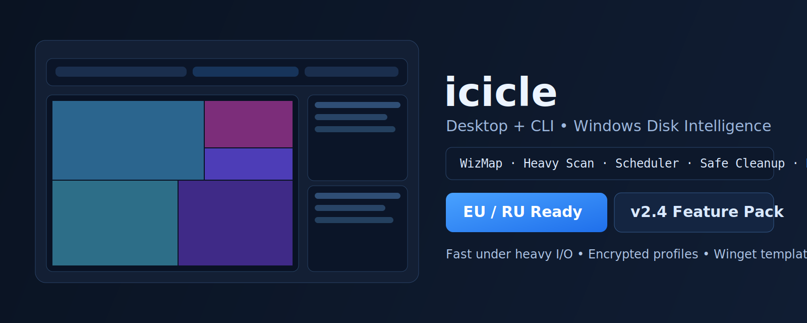
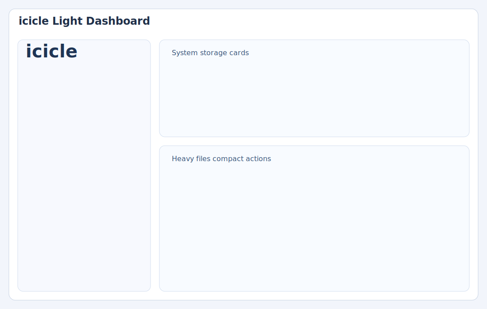

# icicle

<p align="center">
  
</p>

<p align="center">
  <strong>Premium Windows Disk Intelligence Suite</strong><br/>
  Native Desktop App + Fast CLI for heavy scans, interactive treemap, automation, and safe cleanup.
</p>

<p align="center">
  <a href="https://github.com/Eugeneofficial/icicle/actions/workflows/ci.yml"></a>
  <a href="LICENSE"></a>
  <a href="go.mod"></a>
  <a href="https://github.com/Eugeneofficial/icicle/releases"></a>
  <a href="https://github.com/Eugeneofficial/icicle/stargazers"></a>
</p>

## EU Block (EN)

`icicle` is a production-grade Windows storage analyzer and cleanup tool.
It combines a native Wails desktop UI with a high-performance Go CLI.

Core value:
- Fast `tree` / `heavy` / `extensions` scans on large disks
- Interactive `WizMap` treemap with drill-down navigation
- Scheduled scans and scheduled cleanup from GUI
- Safe delete to Recycle Bin + queue + undo
- Advanced include/ignore filters for scan pipelines
- Plugin-style routing rules (`ext`, `contains`, `prefix`, `regex`)
- Encrypted profile export/import for portable setups

## RU Block (Полная версия)

`icicle` — это профессиональный инструмент для Windows, который помогает быстро находить, сортировать и очищать файлы на больших дисках. Проект объединяет нативный Desktop GUI и быстрый CLI, чтобы работать одинаково удобно и руками, и через автоматизацию.

Что внутри:
- быстрые команды `tree`, `heavy`, `extensions`
- интерактивная карта места `WizMap` (как treemap)
- планировщик сканов и планировщик очистки прямо в GUI
- безопасное удаление в корзину + очередь действий + `undo`
- фильтры include/ignore для точного сканирования
- гибкие правила маршрутизации файлов
- шифрованный экспорт/импорт профиля (portable)
- RU/EN локализация, dark/light тема, трей, update flow

## Quick Start

CLI:

```powershell
git clone https://github.com/Eugeneofficial/icicle.git
cd icicle
go build -o icicle.exe ./cmd/icicle
.\icicle.exe
```

Desktop (Wails):

```powershell
.\scripts\build_wails.bat
.\icicle-desktop.exe
```

Manual desktop build:

```powershell
go build -tags "wails,production" -o icicle-desktop.exe ./cmd/icicle-wails
```

## Installer / Winget (Optional)

```powershell
powershell -ExecutionPolicy Bypass -File .\scripts\build_installer.ps1
powershell -ExecutionPolicy Bypass -File .\scripts\package_winget.ps1 -Version 2.4.0
```

## Screens

<p align="center">
  
  
  
</p>

## Docs

- [ROADMAP.md](ROADMAP.md)
- [CHANGELOG.md](CHANGELOG.md)
- [BENCHMARKS.md](BENCHMARKS.md)
- [TESTING.md](TESTING.md)
- [CONTRIBUTING.md](CONTRIBUTING.md)
- [SECURITY.md](SECURITY.md)

## Topics

`windows`, `disk-cleanup`, `storage-analyzer`, `file-manager`, `golang`, `wails`, `desktop-app`, `cli`, `automation`, `performance`, `treemap`

## License

MIT. See [LICENSE](LICENSE).
