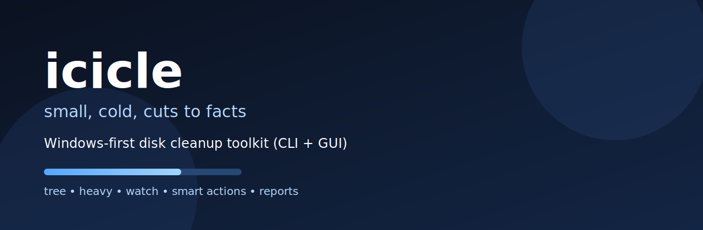

# icicle



**icicle** is a Windows-first disk cleanup toolkit with **CLI + GUI**.  
Fast scans, heavy file analysis, folder watch auto-sort, and practical file actions in one app.

[](https://github.com/Eugeneofficial/icicle/actions/workflows/ci.yml)
[](LICENSE)
[](go.mod)
[](https://github.com/Eugeneofficial/icicle/stargazers)
[](https://github.com/Eugeneofficial/icicle/network/members)

## Features

- `tree`: size tree + top files
- `heavy`: top-N largest files
- `watch`: auto-sort new files by extension
- GUI with quick actions: move, delete, reveal
- Bulk actions + filters + export (CSV/JSON/Markdown)
- Drive usage dashboard
- RU/EN language + Light/Dark theme

## Quick Start

```powershell
git clone https://github.com/Eugeneofficial/icicle.git
cd icicle
go build -o icicle.exe ./cmd/icicle
```

Run:

```powershell
.\icicle.exe
```

## Usage

```text
icicle watch [--dry-run] [--no-color] [--no-emoji] [path]
icicle heavy [--n 20] [--no-color] [--no-emoji] [path]
icicle tree [--n 20] [--w 24] [--top 5] [--no-color] [--no-emoji] [path]
```

Defaults when `path` is omitted:
- `watch`: Windows Downloads folder (from User Shell Folders)
- `heavy` / `tree`: Windows Home folder

## Examples

```powershell
.\icicle.exe tree C:\
.\icicle.exe heavy --n 30 D:\
.\icicle.exe watch --dry-run
.\icicle.exe gui
```

## Screenshots

- GUI (premium layout, disk cards, heavy actions)
- CLI (`tree`, `heavy`, `watch`)

Add screenshots in `docs/` and link them here after each release.

## Update

Use the update script from repo root:

```powershell
.\update.bat
```

It runs:
- `git pull --ff-only`
- rebuild `icicle.exe` (if Go is installed)

## Release

```powershell
powershell -ExecutionPolicy Bypass -File .\scripts\release.ps1
```

Release artifacts are generated in `dist/`.

## Roadmap

See: [ROADMAP.md](ROADMAP.md)

## Contributing

Issues and PRs are welcome:
- bug reports with reproduction steps
- UX improvements for GUI
- performance/scanning optimizations

## License

MIT — see [LICENSE](LICENSE).
