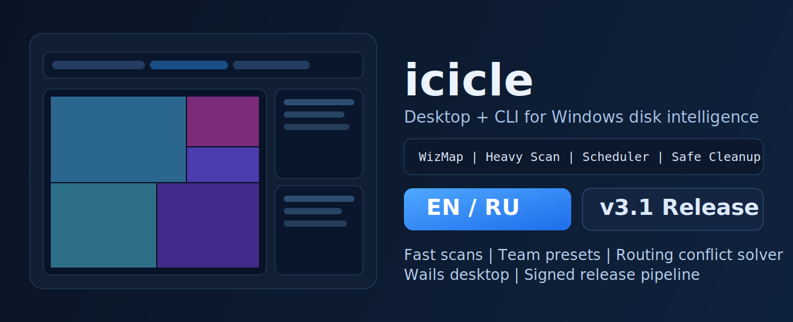
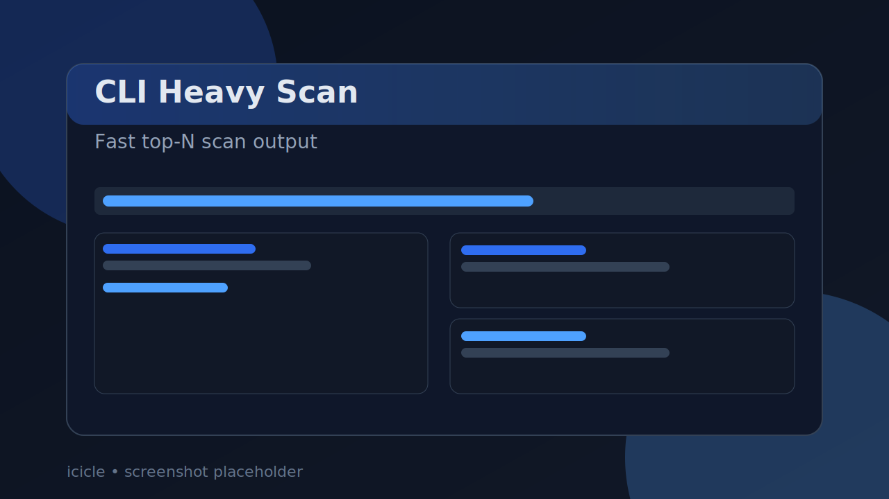
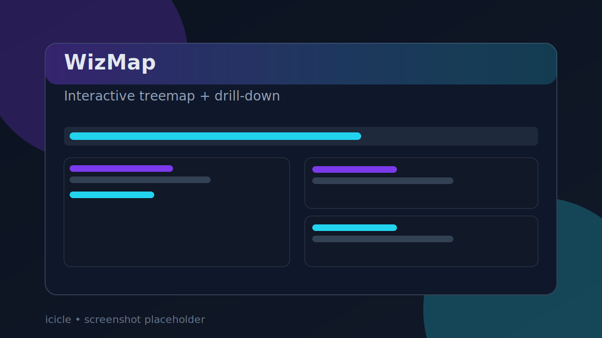
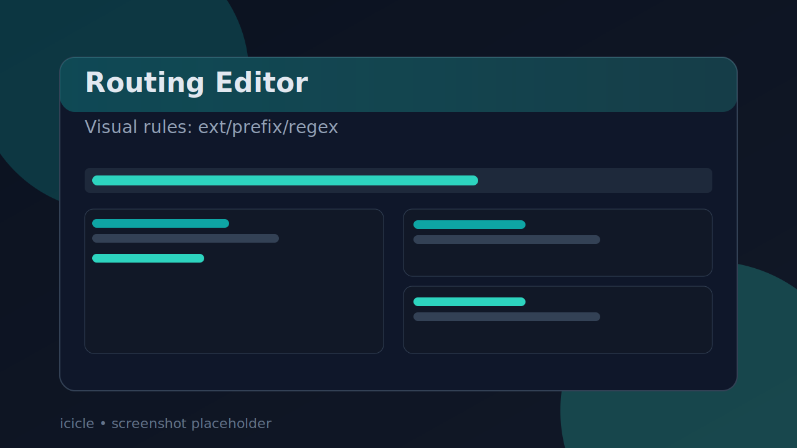
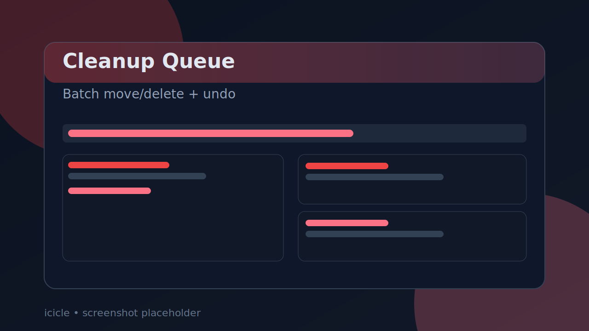
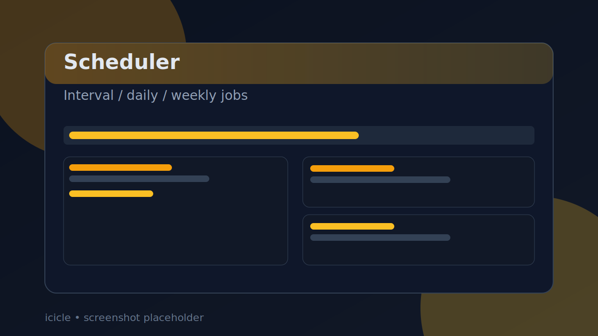
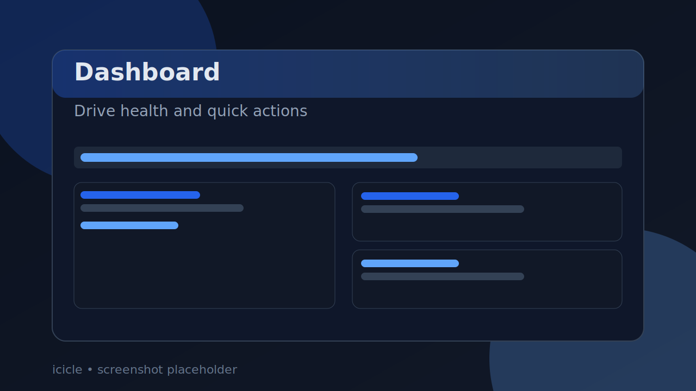
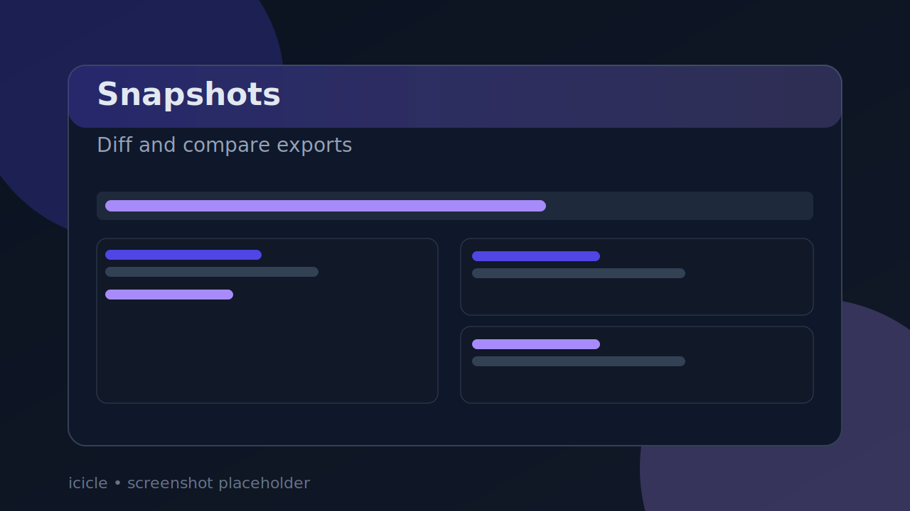

# icicle ❄️

**Windows-first disk cleanup & intelligence toolkit (CLI + native GUI).**  
Fast scans, interactive WizMap treemap, safe cleanup flows, automation, and routing rules in one Go/Wails project.

<p align="left">
  <a href="https://github.com/Eugeneofficial/icicle/stargazers"></a>
  <a href="https://github.com/Eugeneofficial/icicle/network/members"></a>
  <a href="LICENSE"></a>
  <a href="go.mod"></a>
  <a href="https://github.com/Eugeneofficial/icicle/releases"></a>
  <a href="https://github.com/Eugeneofficial/icicle/actions/workflows/ci.yml"></a>
  <a href="https://github.com/Eugeneofficial/icicle/releases"></a>
</p>



> Optional media placeholders (recommended for release):
> - `docs/screenshots/wizmap.svg`
> - `docs/screenshots/dashboard.svg`
> - `docs/screenshots/routing-editor.svg`
> - `docs/screenshots/cli-heavy.svg`

## Table of Contents

- [About](#about)
- [Features](#features)
- [Demo & Screenshots](#demo--screenshots)
- [Installation](#installation)
- [Quick Start](#quick-start)
- [Usage (CLI)](#usage-cli)
- [GUI Highlights](#gui-highlights)
- [Benchmarks](#benchmarks)
- [Roadmap](#roadmap)
- [Contributing & Support](#contributing--support)
- [License](#license)
- [RU Section (Русская версия)](#ru-section-русская-версия)

## About

`icicle` is built for a common Windows pain point: storage grows fast, cleanup is risky, and most tools are either too shallow or too slow for daily use.

The project combines a **fast Go scanning core** with a **native Wails desktop app** and a practical CLI. You can inspect big disks quickly (`tree`, `heavy`, `extensions`), then act safely (Recycle Bin, queue, undo, dry-run).

What makes icicle different is the workflow continuity: from discovery to action. You can scan, visualize, schedule, route, and clean in one place without switching tools.

## Features

### ⚡ Fast Disk Intelligence
- High-speed scans for `tree`, `heavy`, and `extensions`
- Optimized for large disks and heavy I/O workloads
- Include/ignore filters and performance modes (`eco`, `balanced`, `turbo`)



### 🗺️ WizMap Treemap
- Interactive treemap with drill-down and breadcrumbs
- Hover details panel (path, extension, size heat)
- Keyboard navigation + snapshot delta overlays



### 👀 Watch + Auto-Sort
- Folder watch with file routing by extension/prefix/regex rules
- Visual routing rule editor + tester panel
- New file marker (`NEW`) in heavy list



### 🧹 Safe Cleanup Operations
- Safe delete to Recycle Bin
- Batch queue (move/delete), presets, undo flow
- Empty folder discovery with selective removal



### ⏱️ Automation & Scheduling
- Scheduled scans + report snapshots
- Scheduled cleanup with calendar modes (`interval`, `daily`, `weekly`)
- Per-disk cleanup presets (`C:`, `D:`, `E:`)



### 🔐 Portable Profiles
- Encrypted profile export/import
- Import conflict mode: `merge` or `overwrite`
- Team preset pack import/export and URL registry import

## Demo & Screenshots

| Dashboard | WizMap |
|---|---|
|  |  |

| Routing Rules | CLI Heavy |
|---|---|
|  |  |

| Snapshot Diff | Queue Ops |
|---|---|
|  |  |

## Installation

### 1) Portable (recommended)

```powershell
# from repository root
.\icicle-portable.bat
# or
.\update.bat
```

### 2) Build from source (CLI)

```powershell
git clone https://github.com/Eugeneofficial/icicle.git
cd icicle
go build -o icicle.exe ./cmd/icicle
.\icicle.exe
```

### 3) Build native GUI (Wails)

```powershell
.\scripts\build_wails.bat
.\icicle-desktop.exe
```

### 4) Installer path (PowerShell / NSIS / WiX)

```powershell
powershell -ExecutionPolicy Bypass -File .\scripts\install.ps1
# optional pipelines:
powershell -ExecutionPolicy Bypass -File .\scripts\build_installer.ps1
powershell -ExecutionPolicy Bypass -File .\scripts\build_msi_wix.ps1
```

### 5) Winget (planned/templated)

```powershell
powershell -ExecutionPolicy Bypass -File .\scripts\package_winget.ps1 -Version 3.0.0
```

## Quick Start

```powershell
# Fast top files on Downloads
.\icicle.exe heavy --n 20 "%USERPROFILE%\Downloads"

# Size tree on C:
.\icicle.exe tree C:\

# Watch folder and auto-sort incoming files
.\icicle.exe watch "%USERPROFILE%\Downloads"
```

## Usage (CLI)

```powershell
# Top 50 largest files
icicle heavy --n 50 C:\

# Tree with your target path
icicle tree "%USERPROFILE%\Documents"

# Watch mode (auto-sort based on rules)
icicle watch "%USERPROFILE%\Downloads"
```

> Note: advanced include/ignore filtering is available in GUI scan pipelines.

## GUI Highlights

- Native desktop app via Wails (not browser tab)
- Dark/light themes, RU/EN localization, tray behavior
- Command palette (`Ctrl+K`)
- Quick navigation:
  - `Alt+1` Dashboard
  - `Alt+2` Analyze
  - `Alt+3` Operations
  - `Ctrl+Shift+H` Run Heavy
  - `Ctrl+Shift+T` Run Tree
  - `Ctrl+Shift+W` Run WizMap

## Benchmarks

Source: [`BENCHMARKS.md`](BENCHMARKS.md)

| Scenario | Mode | Result |
|---|---|---|
| `heavy C:\` | fast (`maxFiles=220000`) | ~0.7-0.9s |
| `heavy C:\` | full | depends on full tree size |
| `tree C:\` | full | several seconds on large systems |

Reference environment:
- Windows 11 x64
- SSD/NVMe
- Production build (`go build -tags "wails,production"`)

## Roadmap

Source: [`ROADMAP.md`](ROADMAP.md)

- v2.1-v2.8 delivered (scan pipeline, queue ops, snapshot diff/export, routing editor, signed release flow)
- v3.0 in active hardening:
  - final RU/EN wording polish
  - final visual QA for 1366x768 and 4K
  - continued performance tuning for huge datasets

## Contributing & Support

- Read [`CONTRIBUTING.md`](CONTRIBUTING.md)
- Check [`SECURITY.md`](SECURITY.md) for responsible disclosure
- Open issues for bugs, performance reports, and feature requests
- PRs are welcome for scanner performance, UX polish, and localization quality

## License

MIT — see [`LICENSE`](LICENSE).

---

## RU 

### О проекте

`icicle` — это Windows-first инструмент для анализа дисков и безопасной очистки.  
Он объединяет быстрый Go-движок сканирования, CLI и нативный GUI на Wails.

Подходит для повседневной работы: быстро найти, что занимает место, визуально проверить структуру, безопасно удалить лишнее в корзину и автоматизировать регулярные задачи.

### Основные возможности

- ⚡ Быстрые сканы: `tree`, `heavy`, `extensions`
- 🗺️ Интерактивная карта WizMap (drill-down, breadcrumbs, hover heat panel, hotkeys)
- 👀 Watch + авто-сортировка новых файлов по правилам
- ⏱️ Планировщик сканов и очистки (interval/daily/weekly)
- 🧹 Безопасное удаление в корзину + очередь + undo
- 🧩 Визуальный редактор routing rules (`ext` / `prefix` / `regex`) + тестер
- 🔐 Шифрованные portable-профили (export/import, merge/overwrite)
- 🖥️ Нативный GUI (темы, трей, RU/EN)
- 🧰 CLI + GUI в одном проекте

### Быстрый старт (RU)

```powershell
git clone https://github.com/Eugeneofficial/icicle.git
cd icicle
.\scripts\build_wails.bat
.\icicle-desktop.exe
```

### Статус релиза

Текущая версия: **v3**.

---

<p align="center">
  Built with Go + Wails • MIT • Maintained by <a href="https://github.com/Eugeneofficial">Eugeneofficial</a><br/>
  Last README update: <strong>2026-02-15</strong>
</p>

