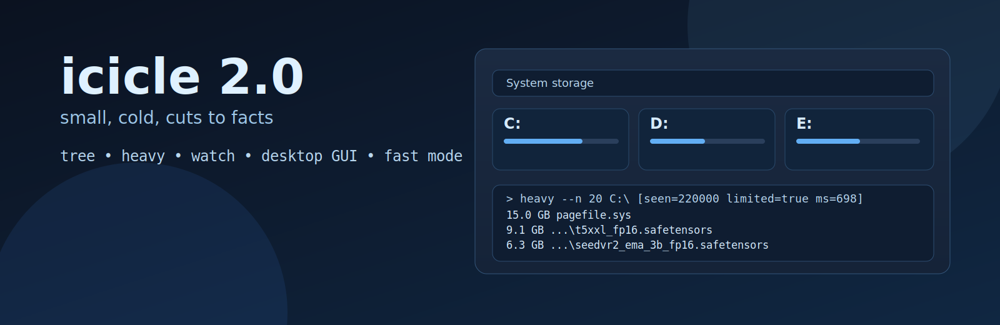
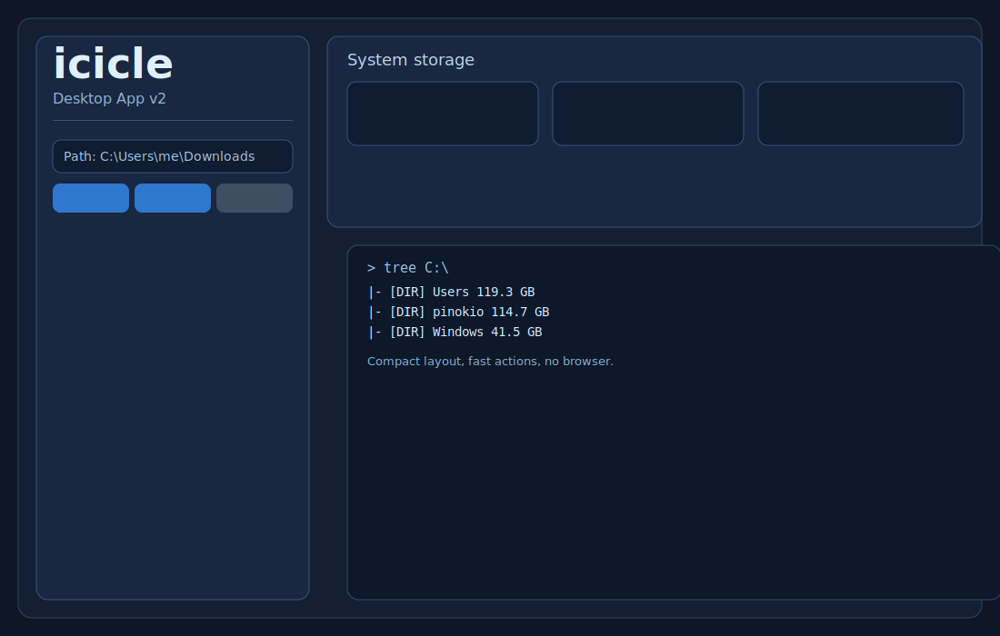

# icicle

<p align="center">
  
</p>

<p align="center">
  <b>Windows storage cleaner with fast CLI + native desktop app (Wails).</b>
</p>

<p align="center">
  <a href="https://github.com/Eugeneofficial/icicle/actions/workflows/ci.yml"></a>
  <a href="LICENSE"></a>
  <a href="go.mod"></a>
  <a href="https://github.com/Eugeneofficial/icicle/stargazers"></a>
</p>

## What Is New In 2.0

- Native desktop app (`icicle-desktop.exe`) without browser.
- Reworked heavy-files panel (compact actions, faster workflow).
- Fast mode tuning: file cap + worker count.
- Built-in export: CSV / JSON / Markdown.
- Tray menu with reopen.
- In-app updater for GitHub Releases.

## Features

- `tree`: size map + top files
- `heavy`: top-N largest files
- `watch`: auto-sort incoming files by extension
- file actions: open, reveal, auto-move, move-to, delete, undo
- recycle-bin safe delete option
- drive usage cards with quick actions
- RU/EN + Dark/Light themes
- fast scan mode for huge folders

## Quick Start (CLI)

```powershell
git clone https://github.com/Eugeneofficial/icicle.git
cd icicle
go build -o icicle.exe ./cmd/icicle
.\icicle.exe
```

## Quick Start (Desktop)

```powershell
.\scripts\build_wails.bat
.\icicle-desktop.exe
```

Manual build:

```powershell
go build -tags "wails,production" -o icicle-desktop.exe ./cmd/icicle-wails
```

## Commands

```text
icicle watch [--dry-run] [path]
icicle heavy [--n 20] [path]
icicle tree [--n 20] [--w 24] [--top 5] [path]
```

Defaults when `path` is omitted:
- `watch`: Windows Downloads
- `heavy` / `tree`: Windows Home

## Screens

<p align="center">
  
  
</p>

## Update

```powershell
.\update.bat
```

`update.bat` runs `git pull --ff-only` and rebuilds binaries.

## Release

```powershell
powershell -ExecutionPolicy Bypass -File .\scripts\release.ps1
```

Artifacts are created in `dist/`.

## Roadmap

See [ROADMAP.md](ROADMAP.md).

## Testing

See [TESTING.md](TESTING.md).

## RU (Коротко)

`icicle` — это быстрый инструмент для очистки диска на Windows.
Есть CLI + desktop GUI, тяжёлые файлы, дерево размеров, watch-сортировка, действия по файлам и автообновление.

## License

MIT, see [LICENSE](LICENSE).
