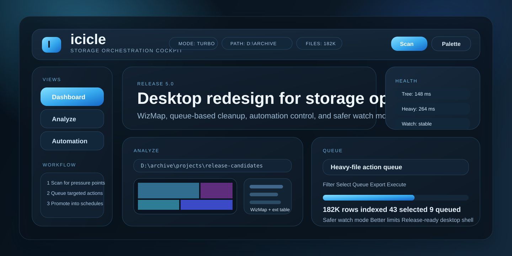

<p align="center">
  
</p>

<p align="center">
  <strong>Windows-first disk intelligence &amp; cleanup cockpit</strong><br/>
  <sub>Fast Go scan core · Native Wails desktop · Practical CLI · Safe cleanup workflows</sub>
</p>

<p align="center">
  <a href="https://github.com/Eugeneofficial/icicle/stargazers"></a>
  <a href="https://github.com/Eugeneofficial/icicle/network/members"></a>
  <a href="LICENSE"></a>
  <a href="go.mod"></a>
  <a href="https://github.com/Eugeneofficial/icicle/releases"></a>
  <a href="https://github.com/Eugeneofficial/icicle/actions/workflows/ci.yml"></a>
</p>

---

## ⚡ The Problem

Most disk tools fail at **one of three things**:

| ❌ Anti-pattern | What happens |
|---|---|
| **Too slow** | Scans take minutes — unusable for everyday diagnostics |
| **No path to action** | Shows big files, but leaves you guessing what to delete |
| **Fragmented workflow** | Discovery, cleanup, and automation live in separate tools |

`icicle` solves all three:

```
Scan fast → See what matters → Queue safe actions → Automate repeatable tasks
```

The result is a **storage-operations workflow for Windows**, not just another "large files" viewer.

---

## 🚀 At a Glance

```powershell
# CLI: Find the 20 largest files in Downloads
icicle heavy --n 20 "%USERPROFILE%\Downloads"

# CLI: Map directory sizes with visual bars
icicle tree "%USERPROFILE%\Documents"

# Desktop: Full analysis workflow
.\icicle-desktop.exe
```

| | | |
|---|---|---|
| **Dashboard** | **WizMap Treemap** | **Heavy Queue** |
| Drive pressure, duplicates, extension hotspots | Interactive space map with hover details & breadcrumbs | Filter, select, queue move/delete, execute |

| | | |
|---|---|---|
| **Routing Editor** | **Scheduler** | **CLI Heavy** |
| Auto-sort rules with dry-run | Interval & calendar-based scans | Terminal-first large file analysis |

---

## 🧠 Core Capabilities

### 🔍 Fast Disk Intelligence

- **`heavy`** — Top-N largest files with concurrent scanning (IO-bound, auto-scaled workers)
- **`tree`** — Directory size mapping with visual ratio bars
- **Extension analytics** — Break down storage by file type with count & size stats
- **Performance modes** — `balanced`, `turbo`, `eco` for different workloads
- **File cap & worker tuning** — Limit scan depth and concurrency for instant results

### 🖥️ Native Desktop Workflow

- **Wails app**, not a browser tab — native tray integration, fast startup
- **Command Palette** (`Ctrl+K`) — fuzzy-search all actions
- **Keyboard-first operation** — shortcuts for every workflow
- **Dark/Light themes** — Xiaomi-inspired design system with accent color system
- **RU/EN localization** — full bilingual interface

### 🗺️ Visual Analysis — WizMap

- **Interactive treemap** — clickable space-filling rectangles for directories & files
- **Hover details** — path, extension, size heat, delta indicators
- **Breadcrumb navigation** — drill down/up through directory hierarchy
- **Snapshot delta overlay** — compare two scans visually (added/removed/changed)
- **Turbo mode** — `CPU×4` workers for massive directories

### 🛡️ Safe Actions

- **Recycle Bin delete** — safe-by-default, permanent delete optional
- **Batch queue** — select files, queue move/delete, review before executing
- **Undo-oriented workflow** — move history (up to 200 entries) with one-click restore
- **Empty-folder detection** — find and selectively remove empty directories
- **Dry-run support** — preview routing rules before they execute

### ⚙️ Automation

- **Watch mode** — file system watcher with routing rules, dry-run, stabilization delay
- **Scheduled scans** — interval-based or calendar mode (daily/weekly)
- **Cleanup presets** — `dev-cache`, `games`, `media` with risk levels
- **Routing rules editor** — visual rule builder with conflict detection & auto-priority solver
- **Route simulation** — test rules against sample files or full scan results

### 👥 Portability & Team Use

- **Portable launcher** — zero-install, single-binary operation
- **Profile export/import** — encrypted, with merge vs overwrite resolution
- **Team preset packs** — share routing & cleanup policies across workstations
- **Team preset registry** — remote URL import for centralized management

---

## 🏗️ Architecture

```
icicle/
├── cmd/
│   ├── icicle/              # CLI entry point
│   └── icicle-wails/        # Desktop app (Wails)
│       ├── app_windows.go           # Lifecycle, logging, drives, navigation (~1000 lines)
│       ├── scan_handler.go          # Tree, Heavy, WizMap, ExtStats
│       ├── fileops_handler.go       # Move, Delete, Empty Dirs
│       ├── cleanup_handler.go       # Cleanup Presets, Extension Stats
│       ├── snapshot_handler.go      # Snapshots, Diff, TreemapDiff, Export
│       ├── schedule_handler.go      # Scheduled Scan
│       ├── dup_handler.go           # Duplicate Finder
│       ├── export_handler.go        # Export Heavy (CSV/JSON/MD)
│       ├── watch_handler.go         # Watch mode + Diagnostics
│       ├── navigation_handler.go    # OpenPath, PickFolder, Saved Folders
│       ├── utils_handler.go         # normalizePath, markNewHeavy, helpers
│       ├── helpers_windows.go       # systemStorage, detectUserFolders, recycle bin
│       ├── routing_windows.go       # Routing rules engine
│       ├── filters_windows.go       # Filtered scan wrappers
│       ├── cleanup_presets_windows.go
│       ├── schedule_cleanup_profile_windows.go
│       ├── tray_windows.go          # System tray
│       ├── update_windows.go        # Auto-update
│       └── frontend/                # UI (vanilla HTML/CSS/JS)
│           ├── index.html
│           └── app.css
└── internal/
    ├── scan/                # Core scanner: heavy, tree, extension stats, overview
    ├── commands/            # CLI commands: heavy, tree, watch, interactive
    ├── organize/            # Routing rules and file organization
    ├── ui/                  # CLI theming: colors, bars, human-readable bytes
    ├── meta/                # Version info
    └── singleinstance/      # Mutex-based single-instance guard
```

**Design principles:**
- Domain-separated handlers — each `*_handler.go` owns one workflow
- Shared `App` struct — stateful context, not a dependency injection maze
- Concurrent scanning — IO-bound workers, min 8, max 32, env-overridable
- Safe-by-default — recycle bin, dry-run, undo stack

---

## 📦 Installation

### Quick Start (Portable)

```powershell
.\icicle-portable.bat
```

### Update Existing Checkout

```powershell
.\update.bat
```

### Build from Source

**CLI:**
```powershell
git clone https://github.com/Eugeneofficial/icicle.git
cd icicle
go build -trimpath -buildvcs=false -ldflags "-s -w -buildid=" -o icicle.exe ./cmd/icicle
.\icicle.exe --help
```

**Desktop App:**
```powershell
go build -trimpath -buildvcs=false -ldflags "-s -w -buildid=" ^
  -tags "wails,production" -o icicle-desktop.exe ./cmd/icicle-wails
.\icicle-desktop.exe
```

**Installer Pipeline:**
```powershell
powershell -ExecutionPolicy Bypass -File .\scripts\install.ps1
powershell -ExecutionPolicy Bypass -File .\scripts\build_installer.ps1
powershell -ExecutionPolicy Bypass -File .\scripts\build_msi_wix.ps1
```

---

## 🖱️ Desktop UX Guide

### Three Operating Surfaces

| View | Purpose | When to Use |
|---|---|---|
| **Dashboard** | Drive pressure, duplicates, extension hotspots | First thing you see — spot saturation before it's a problem |
| **Analyze** | WizMap + Heavy queue + Tree | Drill into a specific path, build cleanup queue |
| **Automation** | Watch, schedule, routing, exports | Turn manual routines into repeatable operations |

### Keyboard Shortcuts

| Shortcut | Action |
|---|---|
| `Ctrl+K` | Command Palette |
| `Ctrl+1/2/3` | Switch Dashboard / Analyze / Automation |
| `Ctrl+Shift+H` | Run Heavy scan |
| `Ctrl+Shift+T` | Run Tree scan |
| `Ctrl+Shift+W` | Run WizMap |
| `Esc` | Close overlay (palette, onboarding) |

### First-Time Onboarding

On first launch, a 3-step walkthrough explains the workflow. Check **"Don't show again"** to dismiss. Re-open anytime via **Command Palette → "Show Onboarding"**.

---

## 🧪 Quality & Testing

```powershell
# Run all tests
go test ./...

# Build CLI
go build -trimpath -buildvcs=false -ldflags "-s -w -buildid=" -o icicle.exe ./cmd/icicle

# Build Desktop
go build -trimpath -buildvcs=false -ldflags "-s -w -buildid=" ^
  -tags "wails,production" -o icicle-desktop.exe ./cmd/icicle-wails
```

| Resource | Content |
|---|---|
| [`TESTING.md`](TESTING.md) | Test strategy, local checks, benchmark setup |
| [`BENCHMARKS.md`](BENCHMARKS.md) | Performance numbers, scan speed comparisons |
| [`SECURITY.md`](SECURITY.md) | Reporting vulnerabilities, safe defaults |
| [`CONTRIBUTING.md`](CONTRIBUTING.md) | PR workflow, coding standards, areas needing help |
| [`ARCHITECTURE.md`](ARCHITECTURE.md) | Code organization, refactoring plan, design decisions |

---

## 🗺️ Roadmap

### Delivered

- [x] Background full-scan with progressive partial results
- [x] Batch file actions (multi-select, queue, undo stack)
- [x] Duplicate finder v2 (hash mode + quick name mode)
- [x] Storage history timeline per drive
- [x] Scheduled scans + report snapshots
- [x] Smart cleanup presets (Games, Media, Dev cache)
- [x] Full visual charts for drive history timeline
- [x] Snapshot diff viewer (delta between two scans)
- [x] Scheduled cleanup tasks from GUI
- [x] Portable encrypted profile export/import
- [x] Treemap compare mode between snapshots
- [x] Routing rule conflict detector and priority solver
- [x] Delta heat overlay in live WizMap
- [x] New file detection markers (`NEW`) in heavy list
- [x] Heavy-table virtualized rendering with incremental chunk paint
- [x] Command palette and keyboard-first operation
- [x] Onboarding flow for first-time users
- [x] Code refactoring: app_windows.go split into 10 handler files

### Planned (v3.2)

- [ ] Parallel reducer pipeline in scanner (lower lock contention)
- [ ] Persistent snapshot index for instant diff preloading
- [ ] Streaming heavy/tree updates from backend workers
- [ ] Drive-level cache invalidation strategy after file actions
- [ ] Public benchmark dataset pack + monthly perf delta report

---

## 🤝 Contributing

Pull requests are welcome. Especially valuable in:

| Area | What |
|---|---|
| **Scanner performance** | Reduce lock contention, optimize hot loops |
| **Desktop UX** | Interaction quality, responsive behavior, accessibility |
| **Windows reliability** | Edge-case handling, permission errors, path normalization |
| **Localization** | RU/EN glossary consistency, new language support |
| **Packaging** | MSI/EXE installer, winget, scoop |

Start here: [`CONTRIBUTING.md`](CONTRIBUTING.md)

---

## 📄 License

**MIT License** — See [`LICENSE`](LICENSE) for details.

---

<p align="center">
  <sub>Built with <a href="https://go.dev/">Go</a> + <a href="https://wails.io/">Wails</a> · MIT License · Maintained by <a href="https://github.com/Eugeneofficial">@Eugeneofficial</a></sub><br/>
  <sub>README refreshed for <strong>v5.0.0</strong> on <strong>2026-04-04</strong></sub>
</p>
