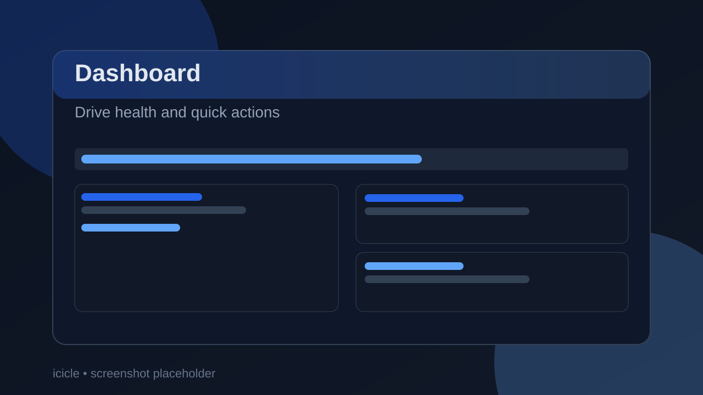
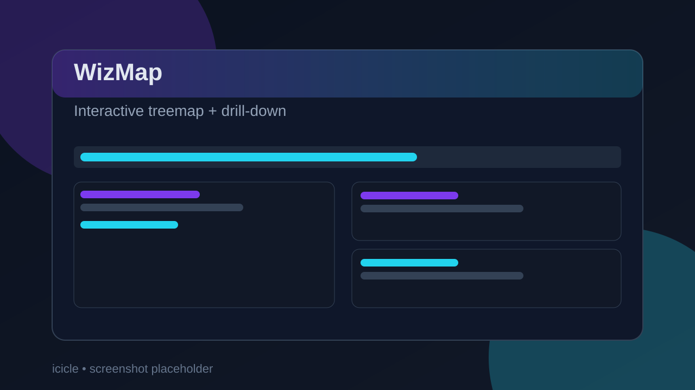
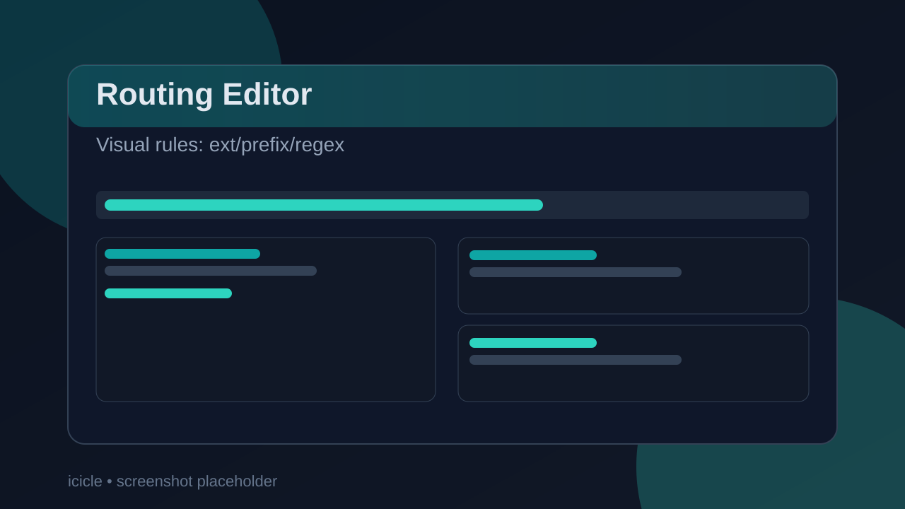
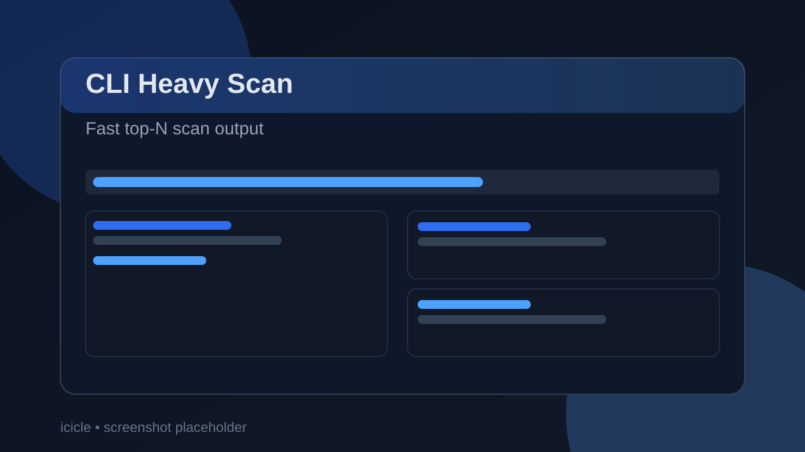
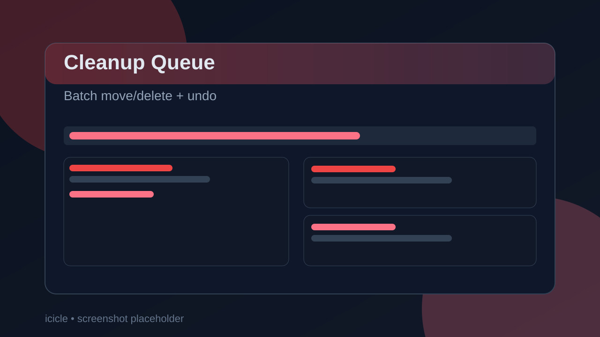

# icicle

**Windows-first disk intelligence and cleanup cockpit.**  
`icicle` combines a fast Go scan core, a native Wails desktop app, and a practical CLI for finding storage pressure, understanding disk layout, and executing safer cleanup workflows.

<p align="left">
  <a href="https://github.com/Eugeneofficial/icicle/stargazers"></a>
  <a href="https://github.com/Eugeneofficial/icicle/network/members"></a>
  <a href="LICENSE"></a>
  <a href="go.mod"></a>
  <a href="https://github.com/Eugeneofficial/icicle/releases"></a>
  <a href="https://github.com/Eugeneofficial/icicle/actions/workflows/ci.yml"></a>
  <a href="https://github.com/Eugeneofficial/icicle/releases"></a>
</p>


## Why icicle

Most disk tools fail at one of three things:
- they scan too slowly for everyday use,
- they show data without giving you a safe path to action,
- or they split discovery, cleanup, and automation into different tools.

`icicle` is built to keep that workflow continuous:
1. Scan fast.
2. See what matters.
3. Queue safe actions.
4. Automate repeatable cleanup.

The result is a storage-operations workflow for Windows rather than just another "large files" viewer.

## What You Get

### Fast disk intelligence
- Large-file analysis with `heavy`
- Directory size mapping with `tree`
- Extension analytics and scan filters
- Performance modes for different systems and workloads

### Native desktop workflow
- Wails desktop app, not a browser tab
- RU/EN localization
- Dark/light themes
- Tray integration, command palette, keyboard shortcuts

### Visual analysis
- Interactive WizMap treemap
- Hover details and breadcrumbs
- Snapshot-aware workflows and delta-oriented inspection

### Safe actions
- Recycle Bin delete flow
- Batch queue for move/delete
- Undo-oriented cleanup workflow
- Empty-folder detection and selective removal

### Automation
- Watch mode with routing rules
- Scheduling for scans and cleanup
- Presets for repeated operating patterns
- Routing editor and route simulation flows

### Portability and team use
- Portable mode launcher
- Profile export/import
- Team preset pack flows
- Release-ready desktop and CLI binaries

## Highlights

### WizMap + heavy-file queue
`icicle` is strongest when you move from visualization to action without context switching.  
You can inspect a path in WizMap, jump into heavy-file analysis, filter the result set, queue actions, and execute only the smallest useful batch.

### Watch mode that behaves like an operator tool
Watch mode is not just "move files by extension".  
It is part of a larger routing workflow with rules, diagnostics, dry-run support, and safer handling for changing files.

### Desktop redesign in v5
The current desktop generation is centered on three operating surfaces:
- `Dashboard` for overview and storage pressure
- `Analyze` for path-level investigation and action queueing
- `Automation` for watch, schedule, export, and routing control

## Screenshots

| Dashboard | WizMap |
|---|---|
|  |  |

| Routing Rules | Heavy CLI |
|---|---|
|  |  |

| Scheduler | Cleanup Queue |
|---|---|
|  |  |

## Installation

### Portable

```powershell
.\icicle-portable.bat
```

### Update existing repo checkout

```powershell
.\update.bat
```

### Build CLI

```powershell
git clone https://github.com/Eugeneofficial/icicle.git
cd icicle
go build -trimpath -buildvcs=false -ldflags "-s -w -buildid=" -o icicle.exe ./cmd/icicle
.\icicle.exe
```

### Build desktop app

```powershell
go build -trimpath -buildvcs=false -ldflags "-s -w -buildid=" -tags "wails,production" -o icicle-desktop.exe ./cmd/icicle-wails
.\icicle-desktop.exe
```

### Installer-related scripts

```powershell
powershell -ExecutionPolicy Bypass -File .\scripts\install.ps1
powershell -ExecutionPolicy Bypass -File .\scripts\build_installer.ps1
powershell -ExecutionPolicy Bypass -File .\scripts\build_msi_wix.ps1
```

## Quick Start

```powershell
# Top largest files in Downloads
.\icicle.exe heavy --n 20 "%USERPROFILE%\Downloads"

# Tree view on a target path
.\icicle.exe tree "%USERPROFILE%\Documents"

# Watch Downloads with auto-sort rules
.\icicle.exe watch "%USERPROFILE%\Downloads"
```

## CLI

```powershell
icicle heavy --n 50 C:\
icicle tree C:\
icicle watch "%USERPROFILE%\Downloads"
```

Current main commands:
- `heavy`
- `tree`
- `watch`
- `version`

## Desktop App

Desktop UX includes:
- command palette (`Ctrl+K`)
- quick navigation across core views
- heavy-file filtering, sorting, selection, and queue actions
- WizMap navigation and extension view
- watch diagnostics and route tooling
- theme and language switching

## Quality and Testing

Recommended local checks:

```powershell
go test ./...
go build -trimpath -buildvcs=false -ldflags "-s -w -buildid=" -o icicle.exe ./cmd/icicle
go build -trimpath -buildvcs=false -ldflags "-s -w -buildid=" -tags "wails,production" -o icicle-desktop.exe ./cmd/icicle-wails
```

More detail:
- [`TESTING.md`](TESTING.md)
- [`BENCHMARKS.md`](BENCHMARKS.md)

## Project Docs

- [`CHANGELOG.md`](CHANGELOG.md)
- [`ROADMAP.md`](ROADMAP.md)
- [`CONTRIBUTING.md`](CONTRIBUTING.md)
- [`SECURITY.md`](SECURITY.md)
- [`RELEASE_NOTES_v5.0.0.md`](RELEASE_NOTES_v5.0.0.md)

## Contributing

Pull requests are welcome, especially in these areas:
- scanner performance
- desktop UX and interaction quality
- Windows reliability
- localization quality
- packaging and release tooling

Start here:
- [`CONTRIBUTING.md`](CONTRIBUTING.md)

## License

MIT. See [`LICENSE`](LICENSE).

---

# icicle на русском

**Windows-first cockpit для анализа дисков и безопасной очистки.**  
`icicle` объединяет быстрый Go-движок сканирования, нативный desktop GUI на Wails и практичный CLI, чтобы находить, что съедает место, понимать структуру диска и безопасно выполнять cleanup-задачи.

## Зачем нужен icicle

Большинство disk cleanup tools ломаются в одном из трёх мест:
- слишком медленно работают для повседневного сценария,
- показывают данные, но не дают безопасного пути к действию,
- или разрывают анализ, очистку и автоматизацию по разным инструментам.

`icicle` построен как единый рабочий цикл:
1. Быстро просканировать.
2. Увидеть, что реально важно.
3. Собрать безопасные действия в очередь.
4. Автоматизировать повторяющиеся сценарии.

Это не просто "поиск больших файлов", а более цельный storage-operations workflow под Windows.

## Что умеет

### Быстрый анализ диска
- Поиск тяжёлых файлов через `heavy`
- Карта размеров директорий через `tree`
- Аналитика по расширениям
- Фильтры и performance modes

### Нативный desktop workflow
- Настоящее desktop-приложение на Wails
- RU/EN интерфейс
- Светлая и тёмная темы
- Трей, command palette, горячие клавиши

### Визуальный анализ
- Интерактивная treemap-карта WizMap
- Hover details и breadcrumbs
- Сценарии со snapshot/delta-анализом

### Безопасные действия
- Удаление в корзину
- Batch queue для move/delete
- Undo-ориентированный cleanup flow
- Поиск пустых папок и выборочное удаление

### Автоматизация
- Watch mode с routing rules
- Планировщик сканов и очистки
- Presets для повторяющихся сценариев
- Редактор правил и route simulation

### Portable и командное использование
- Portable launcher
- Export/import профилей
- Team preset pack flows
- Готовые desktop и CLI binaries

## Ключевые сильные стороны

### WizMap + heavy-file queue
Сильная сторона `icicle` в том, что он не обрывает контекст между анализом и действием.  
Можно открыть путь в WizMap, перейти в heavy-анализ, отфильтровать выдачу, собрать очередь действий и выполнить только тот batch, который реально меняет ситуацию на диске.

### Watch mode как операторский инструмент
Здесь watch mode - это не просто "перенести файл по расширению".  
Это часть более широкого routing workflow: с правилами, диагностикой, dry-run и более безопасным поведением при изменяющихся файлах.

### Desktop redesign в v5
Текущее поколение desktop-интерфейса построено вокруг трёх рабочих поверхностей:
- `Dashboard` для обзора и pressure-сигналов
- `Analyze` для расследования по пути и action queue
- `Automation` для watch, schedule, export и routing-контроля

## Скриншоты

| Dashboard | WizMap |
|---|---|
|  |  |

| Routing Rules | Heavy CLI |
|---|---|
|  |  |

| Scheduler | Cleanup Queue |
|---|---|
|  |  |

## Установка

### Portable

```powershell
.\icicle-portable.bat
```

### Обновление существующего checkout

```powershell
.\update.bat
```

### Сборка CLI

```powershell
git clone https://github.com/Eugeneofficial/icicle.git
cd icicle
go build -trimpath -buildvcs=false -ldflags "-s -w -buildid=" -o icicle.exe ./cmd/icicle
.\icicle.exe
```

### Сборка desktop app

```powershell
go build -trimpath -buildvcs=false -ldflags "-s -w -buildid=" -tags "wails,production" -o icicle-desktop.exe ./cmd/icicle-wails
.\icicle-desktop.exe
```

### Скрипты для installer pipeline

```powershell
powershell -ExecutionPolicy Bypass -File .\scripts\install.ps1
powershell -ExecutionPolicy Bypass -File .\scripts\build_installer.ps1
powershell -ExecutionPolicy Bypass -File .\scripts\build_msi_wix.ps1
```

## Быстрый старт

```powershell
# Найти самые тяжёлые файлы в Downloads
.\icicle.exe heavy --n 20 "%USERPROFILE%\Downloads"

# Посмотреть дерево размеров
.\icicle.exe tree "%USERPROFILE%\Documents"

# Запустить watch mode на Downloads
.\icicle.exe watch "%USERPROFILE%\Downloads"
```

## CLI

```powershell
icicle heavy --n 50 C:\
icicle tree C:\
icicle watch "%USERPROFILE%\Downloads"
```

Основные команды:
- `heavy`
- `tree`
- `watch`
- `version`

## Desktop App

Что есть в desktop UX:
- command palette (`Ctrl+K`)
- быстрая навигация между основными экранами
- heavy-file filtering, sorting, selection и queue actions
- WizMap navigation и extension view
- watch diagnostics и route tooling
- переключение темы и языка

## Качество и тестирование

Базовые локальные проверки:

```powershell
go test ./...
go build -trimpath -buildvcs=false -ldflags "-s -w -buildid=" -o icicle.exe ./cmd/icicle
go build -trimpath -buildvcs=false -ldflags "-s -w -buildid=" -tags "wails,production" -o icicle-desktop.exe ./cmd/icicle-wails
```

Подробности:
- [`TESTING.md`](TESTING.md)
- [`BENCHMARKS.md`](BENCHMARKS.md)

## Документация проекта

- [`CHANGELOG.md`](CHANGELOG.md)
- [`ROADMAP.md`](ROADMAP.md)
- [`CONTRIBUTING.md`](CONTRIBUTING.md)
- [`SECURITY.md`](SECURITY.md)
- [`RELEASE_NOTES_v5.0.0.md`](RELEASE_NOTES_v5.0.0.md)

## Контрибьютинг

Особенно полезны PR в следующих направлениях:
- производительность scanner core
- качество desktop UX
- Windows reliability
- локализация и текстовая консистентность
- packaging и release tooling

Стартовая точка:
- [`CONTRIBUTING.md`](CONTRIBUTING.md)

## Лицензия

MIT. См. [`LICENSE`](LICENSE).

---

<p align="center">
  Built with Go + Wails • MIT • Maintained by <a href="https://github.com/Eugeneofficial">Eugeneofficial</a><br/>
  README refreshed for <strong>v5.0.0</strong> on <strong>2026-03-06</strong>
</p>
